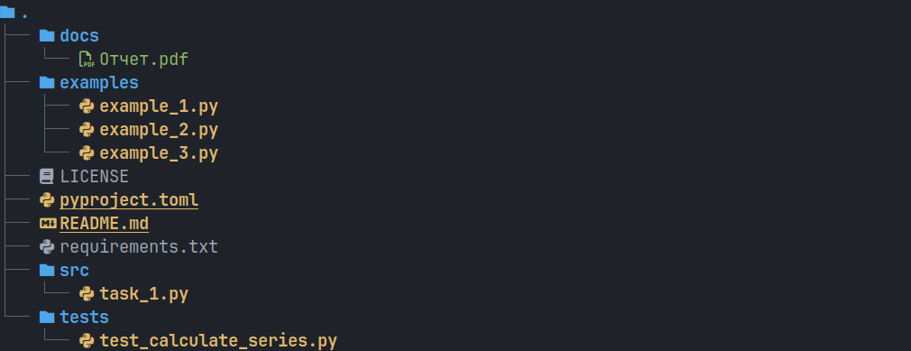

# Лабораторная работа №10 (2.23)
**Предмет** Объектно-ориентированное программирование  
**Тема:** Управление потоками в Python  
**Вариант:** 8  

## Содержание

1. [Описание работы](#описание-работы)  
2. [Ссылка на отчет](#ссылка-на-отчет)  
3. [Структура репозитория](#структура-репозитория)  
4. [Задания](#задания)  

---

## Описание работы

Приобретение навыков написания многопоточных приложений на языке программирования Python версии 3.x.

---

## Ссылка на отчет

[Отчет о выполнении лабораторной работы](docs/Отчет.pdf)

---

## Структура репозитория

- `src/` — исходный код программы  
- `docs/` — отчет по лабораторной работе  
- `assets/` — вспомогательные изображения
- `.pre-commit-config.yaml` — конфигурация pre-commit
- `requirements.txt` — список зависимостей

---

## Задания

### Задание №1  
Выполните индивидуальное задание. Приведите в отчете скриншоты работы программы решения индивидуального задания.
С использованием многопоточности для заданного значения найти сумму ряда с точностью члена ряда S по абсолютному значению ε=10-7 и произвести сравнение полученной суммы с контрольным значением функции для двух бесконечных рядов.
